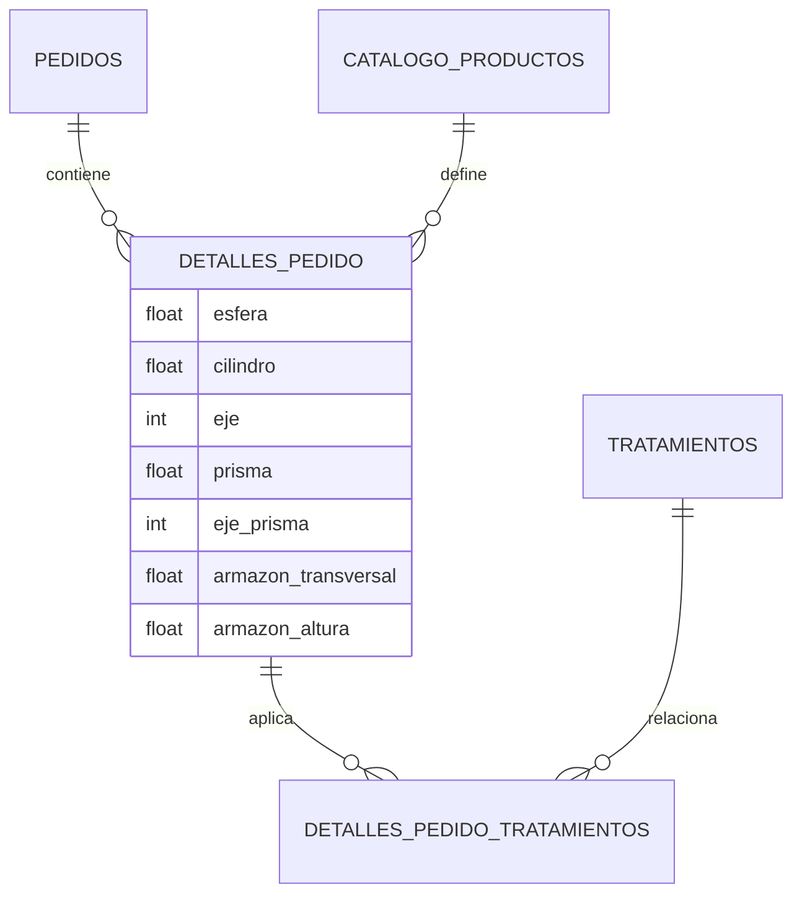

# Esquema de Base de Datos: ExtraRango

El sistema utiliza Prisma como ORM para gestionar la persistencia en PostgreSQL. Este documento detalla los modelos clave tras la expansión para Prisma y Armazón.

## Modelos Principales

### `pedidos`
Representa la cabecera del remito o pedido general.
- `id`: Identificador único (Auto-incremental).
- `usuario_id`: Relación con el usuario comprador.
- `estado`: PENDIENTE, EN_PROCESO, COMPLETADO.
- `cotizacion_dolar_dia`: Valor del dólar al momento de la compra.
- `total_usd`: Total en dólares.
- `total_ars`: Total en pesos argentinos calculado al momento.
- `created_at`: Fecha de creación.

### `detalles_pedido`
Cada fila representa un cristal específico configurado.
- `ojo`: DERECHO, IZQUIERDO, AMBOS.
- **Campos Ópticos**:
    - `esfera`, `cilindro`, `eje`, `adicion`.
    - `prisma` (Decimal): Nuevo campo para prismas (Δ).
    - `eje_prisma` (Int): Nuevo campo para la base del prisma.
- **Medidas de Armazón**:
    - `armazon_transversal` (Decimal - Distancia A).
    - `armazon_altura` (Decimal - Distancia B).
    - `armazon_diagonal` (Decimal - Distancia ED).
    - `armazon_puente` (Decimal - Distancia DBL).
- **Financieros**:
    - `precio_unitario_usd`: Valor (Par / 2).
    - `subtotal_usd`: (Unitario * Cantidad).

### `detalles_pedido_tratamientos`
Relación muchos a muchos entre el detalle de un cristal y sus tratamientos.
- `detalle_pedido_id`: Referencia al cristal.
- `tratamiento_id`: Referencia al tratamiento del catálogo.
- `precio_usd`: Snapshot del precio al momento de la compra.

## Visualización del Esquema (Mermaid)

## Mantenimiento
Para actualizar la base de datos tras cambios en el archivo `schema.prisma`, utilizar:
`npx prisma db push`
 (Nota: Se recomienda `db push` para entornos de desarrollo ágil y `migrate dev` para producción).
